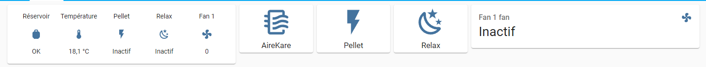

# Edilkamin for Home Assistant



This little integration provides :

- binary sensor :
  - thank pellet
- sensor :
  - get the temperature
  - get the speed of fan 1
- switch :
  - turn on/off the power  
  - turn on/off the airkare function
  - turn on/off the relax function
- fan :
  - modify the fan 1 speed   

_Pay attention_ : this integration works because the API of Edilkamin is not secure. If the API changes, I cannot guarantee that the integration will continue to work.

## Installation

### Manual Installation
1. Download the latest release.
1. Extract the files and move the `edilakmin` folder into the path to your custom_components. e.g. /config/custom_components.
2. Restart Home Assistant
3. In the home assistant configuration screen click on Integrations.
4. Click on the + icon to add a new integration.
5. Search for `Edilakmin` and select it.
6. Enter the mac address of the stove name and click Submit.

### Installation via Home Assistant Community Store (HACS)
1. Ensure HACS is installed.
1. Add the repo(https://github.com/algra4/edilkamin) has custom repo ([HACS how-to](https://hacs.xyz/docs/faq/custom_repositories))
1. Search for and install the "Edilkamin" integration
2. Restart Home Assistant
3. In the home assistant configuration screen click on Integrations.
4. Click on the + icon to add a new integration.
5. Search for `Edilakmin` and select it.
6. Enter the mac address of the stove name and click Submit.


## Configuration 

```yaml
edilkamin:
  - mac_address: XX:XX:XX:XX:XX:XX
```

## Tested device :

- Myrna 
  - motherboard : 1.58.201215a
  - wifi_ble_module : 1.0_20
